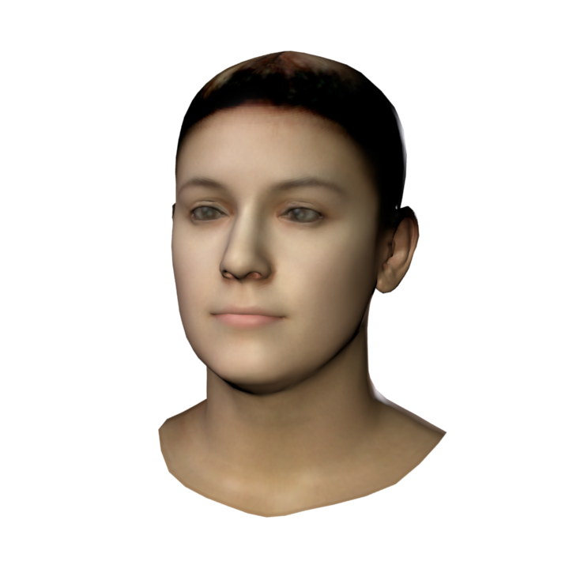

# Public 3DMM

## BFM:Basel Face Model(2009/2017)
200 individuals/ neutral face

## Facewarehouse(2014) 
150 individuals/ 20 expression

## Surrey Face Model
169 individual / multi-resolution

## FLAME(2017/2020)
- [FLAME: Faces Learned with an Articulated Model and Expressions](https://github.com/Rubikplayer/flame-fitting)

> FLAME is a lightweight and expressive generic head model learned from over 33,000 of accurately aligned 3D scans.

> FLAME can e.g. be used to synthesize new motion sequences, by transferring the facial expression from a source actor to a target actor
Our FLAME model (Faces Learned with an Articulated Model andExpressions) is factored in that it separates the representation ofidentity, pose, and facial expression, similar to models of the hu-man body [Anguelov et al.2005; Loper et al.2015]. To keep themodel simple, computationally efficient, and compatible with exist-ing game and rendering engines, we define a vertex-based modelwith a relatively low polygon count, articulation, and blend skin-ning. Specifically FLAME includes a learned shape space of identityvariations, an articulated jaw and neck, and eyeballs that rotate.Additionally we learn pose-dependent blendshapes for the jaw andneck from examples. Finally, we learn “expression” blendshapes tocapture non-rigid deformations of the face

# Blender hairsytle
- [particle-hair](https://blenderartists.org/t/particle-hair-from-meshes-bezier-curves-nurbs/1154670)

# Human Face dataset
- [RFW: Racial equality](http://whdeng.cn/RFW/index.html)
- [AgeDB: the first manually collected, in-the-wild age database](https%3A%2F%2Fibug.doc.ic.ac.uk%2Fmedia%2Fuploads%2Fdocuments%2Fagedb.pdf)
- [Flickr-Faces-HQ Dataset (FFHQ) Style GAN](https://github.com/NVlabs/ffhq-dataset)
- [CeleA-HQ (89G)](https://github.com/suvojit-0x55aa/celebA-HQ-dataset-download)

# Recap Proposal

~~i) learn Unity, and find face models / tools to construct face models (eg naturalfront.com);~~ 
ii) construct sufficient face identities with variations and generate a large synthetic data set;
iii) implement an architecture from literature to compare results of **synthetic** and **real training**.

# Meeting
------------------------------Past  Experiment-------------------------------------
- [ ] ~~build our own female , male and general models based on the facewarehouse based on FLame's  ideas and codes.~~
  - Take too much time.
- [ ] Extend flame. 
  - ~~We divide the model into regions by feature points and map by regions.~~ 
  - Or other ways for different ages and skin uv mapping
  - (Pending) I tried to change the hairstyle of the model, but it was not very easy to achieve, because the head vertices can be changed as well.
- [x] ~~Aus transfer, build model form image.~~ AKA: model fitting
  - Right Now what I try to solve.

--------------------------------------------------------------------
- [ ] What kind of human face dataset to choose?
  - [ ] How to set parameters for camera position/ pos and ect
    - [ ] 3/explantion/zoom camera angle/
  - [ ] What kind of ~~Re-id~~ Network to compare?
    - [ ] use/Recongition
  - [ ] How many pictures are generated? it is depend on reference Dataset.
- [ ] Go deep into related papers
  - [ ] Learning a model of facial shape and expression from 4D scans (FLAME)
  - [ ] A Morphable Model For The Synthesis Of 3D Faces (BFM)
--------------------------------------------------------------------
- [ ] Start writing report
- [ ] Need some GPU resource (pytorch3d need more memory of GPU...)