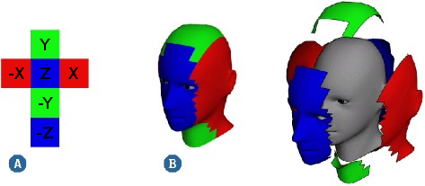

# Dataset
- [Surrey Face Model](https://www.cvssp.org/faceweb/3dmm/facemodel/)
- menpo3d - Tools for manipulating meshes
# Important Papers

# UV 
UV mapping is a technique used to "wrap" a 2D image texture onto a 3D mesh.

## Trandiational method (rendering algorithm)
- [automatically-generating-uv-coordinates-algorithms](https://stackoverflow.com/questions/18578943/automatically-generating-uv-coordinates-algorithms)
- [tri-planar mapping]()
- 
## Neural network method
* NN
  * Neural 3D Mesh Renderer 
* GAN
  * UV-GAN: Adversarial Facial UV Map Completion for Pose-invariant FaceRecognition

### Pros and cons
* Trandiational
  * The traditional method is to divide the face into different areas and map them separately.
    * The advantage is that the materials of different areas can be changed separately
    * divide manually. 
  
* NN
  * Use NN generate uv texture directly
    * no need to divide the area manually.
    * difficult to control the texture of different areas of the face separately
  
# Meeting
- [x] create docker image for convenience
- [x] sorted vertices
- [x] join Blendshape as group
- [ ] weight for different expression
    - For similar expressions, how to determine the weight of each blendshape? 
- [] different face lead to no solution
  - is there a way to make two models have the same number of faces?

next week will focus on surface mapping texture to 3d face model and fix resolution problems.

